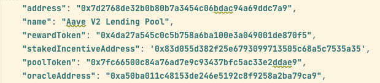

# defi-state-querier

## Description
Return the asset list of an address in a blockchain. These assets are native token, tokens, nft, and the assets locked in protocols.

## Requirement
- Accuracy
- Fastest speed
- Post all requests in a call with maximum batch size and workers

## Input
- address: str (lower case or upper case)
- block_number: int
- chain_id: string. Eg: 0x1, 0x38
- query: array
  + query_id: id of query
  + entity_id: token address, nft or id of protocols like aave-v2, compound, and pancakeswap-amm
  + query_type: one of keywords - token_balance, ntf_balance, deposit_borrow, protocol_reward.

## Output
```
[
  {
    "query_id": "<query_id>",
    "entity_id": "<token_address>",
    "query_type": "token_balance",
    "token_balance": 173.84
  },
  {
    "query_id": "<query_id>",
    "entity_id": "<nft_address>",
    "query_type": "nft_balance",
    "nft_balance": 11
  },
  {
    "query_id": "<query_id>",
    "entity_id": "<protocol_id>",
    "query_type": "deposit_borrow",
    "deposit_borrow": 
 {
      "<asset_address_1>": {
        "borrow_amount": 184.4,
        "deposit_amount": 331.5
      },
      "<asset_address_2>": {
        "borrow_amount": 184.4,
        "deposit_amount": 331.5
      }
    }
  },
  {
    "query_id": "<query_id>",
    "entity_id": "<protocol_id>",
    "query_type": "protocol_reward",
    "protocol_reward": 
   {
      "<asset_address_1>": {
        "deposit": {
          "rewards": {
            "<reward_address>": {
              "amount": 1.4
            }
          }
        },
        "borrow": {
          "rewards": {
            "<reward_address>": {
              "amount": 1.4
            }
          }
        }
      }
    }
  }
]
```

## Query state data

### Preparation

Get some information of protocols in their github or documents.

[1] Create abi files having format like [erc20 token abi](src/defi_services/abis/token/erc20_abi.py) or [aave v3 lending abi](src/defi_services/abis/lending/aave_v3/aave_v3_lending_pool_abi.py).

[2] Get basic information of protocols and save in a python file like [aave_v2_eth.py](src/defi_services/services/lending/lending_info/ethereum/aave_v2_eth.py).
**** 

### Important files

[1] [state_querier.py](src/defi_services/jobs/state_querier.py) - create function information, encode function calls, push function calls, and decode response data.

[2] [state_processor.py](src/defi_services/jobs/state_processor.py) - receive [input](#input), combine all encoded function calls in a batch, execute function call batch, process response data, and return [output](#output).

[3] [protocol_services.py](src/defi_services/services/protocol_services.py) - protocol service pattern file, all protocols should follow this file like [aave_v2_services.py](src/defi_services/services/lending/aave_v2_services.py). There are 4 main functions of a service: get service info, get token list related to protocol, get asset information supported by protocol (dapp), get all information of function calls, and process response data.

[4] [token_services.py](src/defi_services/services/token_services.py) - get information of erc 20 function calls and process response data.

### Examples
[1] [token_information.py](example/token_information.py) - example of using state querier.

[2] [wallet_information.py](example/wallet_information.py) - example of using state processor.